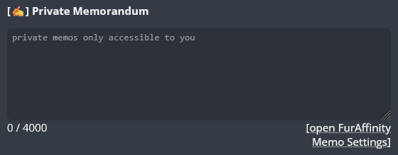
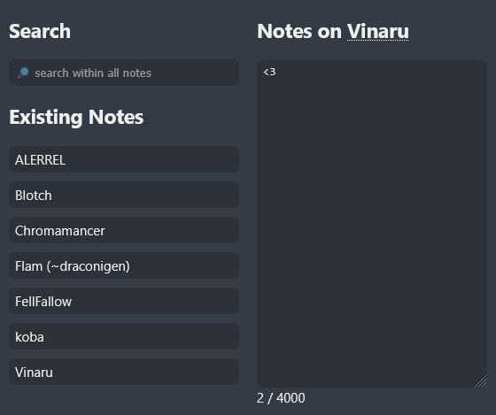

# FurAffinity Memoranda
Keep tabs on artists on FurAffinity by adding private notes to Userpages. Remind yourself what you followed someone for or what you wanted to commission them.

Features:
* Attach private notes to your favorite artists or nemeses.
* Search your notes.

> Beware: Notes are stored on your computer and cannot be accessed by anyone else. They exist as long as the extension remains installed. Uninstalling the extension evicts all data.

A box gets added to each userpage:

The options page lists all entries in one place and lets you search your notes:

## Requirements
* Firefox 148+
* Chrome 145+

## Installation
* For Firefox, go to https://addons.mozilla.org/firefox/addon/furaffinity-memoranda/ and click "Add to Firefox".
* For Chrome, go to ??? and click "Add to Chrome".

## Usage
Visit any Userpage (e.g. [https://www.furaffinity.net/user/draconigen](https://www.furaffinity.net/user/draconigen)). A new section above the profile info should appear: click on `[✍️+] Add Private Memorandum` and start typing.

## Feedback
Feedback welcome at flam@dogpixels.net or [@draconigen on Telegram](https://t.me/@draconigen).

## Contributions
You know HTML / CSS / JS and want to improve this Extension? Pull Requests are always welcome.